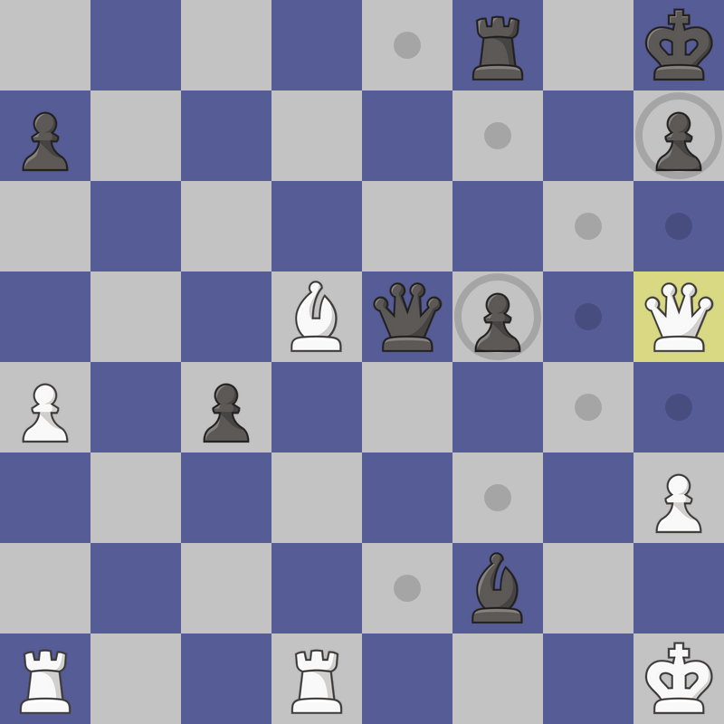

# Caissa

[]
> Note: piece assets are from https://chess.com/

Move calculating checklist:
- [x] PAWN capture
- [x] PAWN march
- [x] BISHOP cross
- [x] KNIGHT jump
- [x] ROOK slide
- [x] QUEEN slide+cross
- [x] KING one-ranged slide+cross
- [x] En passant
- [x] Check coercion
- [x] Check dodging
- [x] Promotion (only for queen)
- [x] Castling